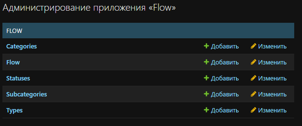
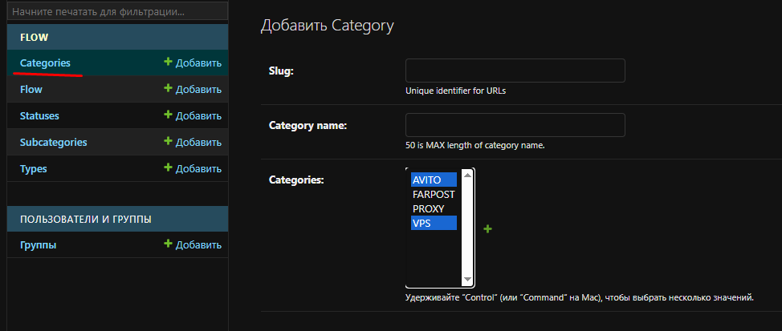
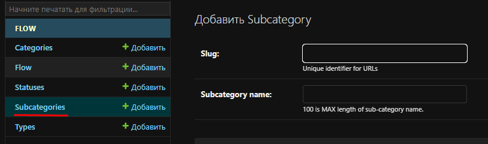
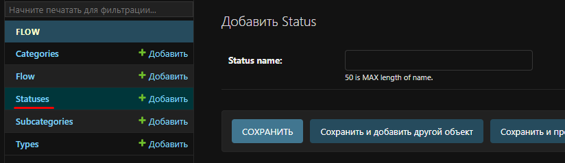
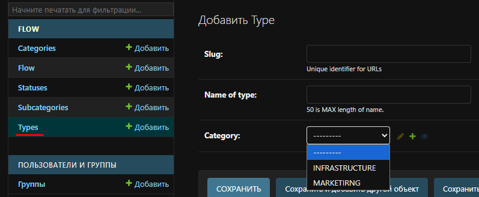
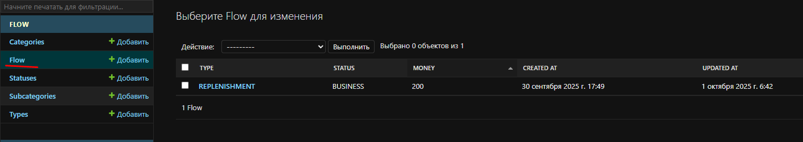
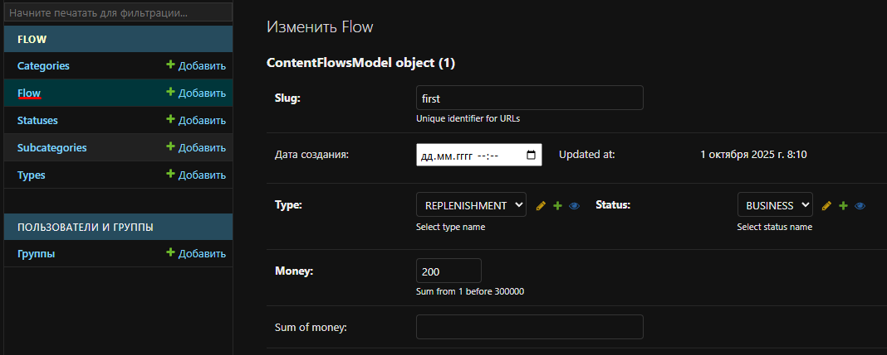
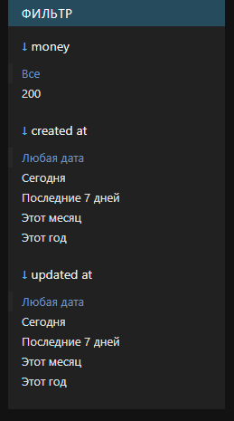
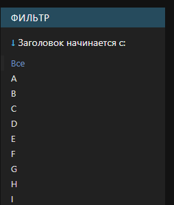
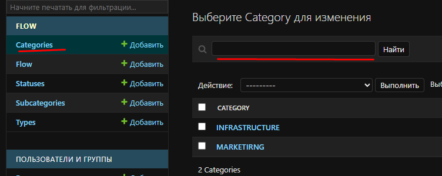

WT
https://docs.google.com/document/d/1q0a99in7kGfNr3ykHAgWVUMFmK0DmA9-F2T2hqBLBos/edit?tab=t.0

----
### Commands

```
py manage.py collectstatic
py manage.py makemigrations
py manage.py migrate
py manage.py runserver # develop
daphne project.asgi:application # mode: develop & poduction 
git log --all --oneline --graph --decorate --date=format:'%Y-%m-%d %H:%M:%S' --pretty=format:'%C(yellow)%h%C(auto)%d %C(white)%cd%Creset %s' # история развития проекта
```
#### Note:
"`py manage.py collectstatic --clear --noinput`" If was changed the static files, it means before the start of works, run the command for an assembly a static's file.


- "`makemigrations`" if you need update collection ща migrations after changing the model of db;
- "`migrate`" - creating/apply (or updating the structures) db by new migration's files for db;
- "`runserver`" - Project (it has dependence the redis, channels, celery, option django async and) is based on the "`daphne`" server.   

---
### Settings.py
File "`project/settings.py`" have a basis option plus:
- "`ASGI_APPLICATION`" django cms was switching to the async mode; 
- "`celery`";
- "`PASSWORD_HASHERS`";  
- "`Logging`" Tah is conf for logs. From root of project we can see the file "`logs.py`". It contains the template for loging; 
- "`swagger`".
- "`CONTENT_TYPES_CHOICES`"


## Admin


## Category

\
Где можно выбрать  N-ое количество под-категорий на одну категорию.

# Subcategories


## Status


## Type


## Data Flow
 \
 

## Filter

||                              |
|:----|:-----------------------------|
| |    |


# Search
 
