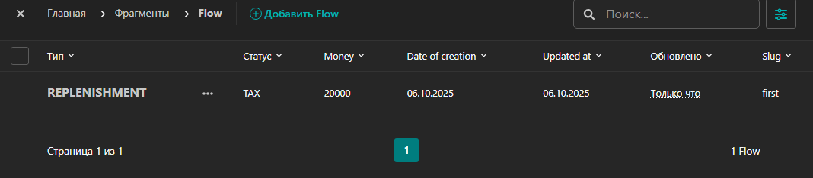

За 5 дней реалиховать полный ТЗ - нет возможности. \
Все условия ТЗ реализованы на стороне панели администратора.

Если представленное в двух репозиториях реализовано не по плану, это лишь вопрос отсутствия согласования вопросов и весьма короткий сроки на реализайию.

[frontend](https://github.com/Tryd0g0lik/flows_fronted)

# APP
- Статус "`flow/models_views/status.py`"; 
- Тип "`flow/models_views/types.py`"; 
- **Категория и подкатегория**:
  - "`flow/models_views/categories.py`";
  - "`flow/models_views/subcategories.py`".

- Комментарий & Сумма & Дата создания и Дата обновления записи:
  - "`flow/models_views/content_flow.py`".
  

>>Пользователь не может выбрать подкатегорию, если она не связана с выбранной категорией.

Создаём *подкатегорию*, затем создаём *категорию* и закрепляем *подкатегории*. 

----
## Commands

```
py manage.py makemigrations
py manage.py migrate
py manage.py collectstatic
py manage.py runserver
daphne project.asgi:application # mode: develop & poduction 
git log --all --oneline --graph --decorate --date=format:'%Y-%m-%d %H:%M:%S' --pretty=format:'%C(yellow)%h%C(auto)%d %C(white)%cd%Creset %s' # история развития проекта
```

### Note:
"`py manage.py collectstatic --clear --noinput`" Запускать после каждого измения статик файлов.
*"`--clear`"* - удаляет старые файлы. *"`--noinput`"* - если не хотите время тратить на комментарии после запуска команды. \
- "`makemigrations`" создать файлы миграции в db;
- "`migrate`" - изменить структуру базы данных;
- "`runserver`" - запускаем локальный сервер "`daphne`" для разработки.   

### *.sh файл для сервера
```sh
#!/bin/bash
cd /home/denis/flows || exit 1
git pull --ff-only origin cicd  || exit 1
# sudo docker compose down || exit 1
if [ "$(sudo docker ps -aq)" ]; then
    echo "Found running FLOW, stopping them..."
    sudo docker compose down || exit 1
    sudo docker builder prune -af  || exit 1
else
    echo "No running FLOW found"
fi

# sudo docker rmi $(sudo docker images -q) || exit 1
if [ "$(sudo docker images -q)" ]; then
    echo "Found docker images, removing them..."
    sudo docker rmi $(sudo docker images -q) || exit 1
else
    echo "No docker images found"
fi


#sudo docker compose -f ./docker-compose.yml build --no-cache
sudo docker compose -f ./docker-compose.yml up -d

echo "Deployment completed successfully"
```
```exp
#!/usr/bin/expect -f
set timeout 600
spawn /home/< user_your_server >/flows/pull.sh
expect "password"
send "< pasword_your_server >\r"
expect eof
```

----
## URL локальный
* "`admin/`"; Старая версия
* "`cms/`"; Новая версия
* "`swagger/`";
* "`redoc/`";
* "`swagger<format>/`".

## DB
|Flow| db                      |
|:---|:------------------------|
||  |


## Админ-панель от Django
### Admin


### Category

\
Где можно выбрать  N-ое количество под-категорий на одну категорию.


# Subcategories


### Status


### Type


### Data Flow
 \
 

### Search
 

### Filter

||                              |
|:----|:-----------------------------|
| |    |

## Админ-панель новая
### Форма входа


### Админ-панель


### Админ-панель Записи


### Админ-панель Категория


### Админ-панель Подкатегории


### Админ-панель Статусы


### Админ-панель Типы


### Админ-панель Flow - Записи


### Филтры & Поиск


### swagger

#### Redoc


## Дерево проекта

```text
Имя
├──.git/
├──.github/
│   |   └──workflows/*
│   │   │   └──*.yml
├──admins/
│   └──filters.py
├──bundles/
│   └──webpack-stats.json	
├──collectstatic/
├──flow/
│   ├──flow_api/ 
│   │   └──*.py
│   ├──migrations/
│   │   └──*.py 
│   ├──models_views/
│   │   └──*.py 
│   └──*.py
├──img/
│   └──*.png
├──nginx/
│   ├──.dockerignore
│   ├──default.conf
│   └──Dockerfile
├──person/
│   ├──migrations/
│   └──*.py
├──project/
│   └──*.py
├──static/
│   ├──scripts/
│   |   └──*.js
│   ├──styles/
│   |   └──*.css
├──templates/
|   └──*.html
├──.browserslistrc
├──.dockerignore
├──.editorconfig
├──.env
├──.flake8
├──.gitignore
├──.pre-commit-config.yaml
├──.pylintrc
├──docker-compose.yml
├──Dockerfile
├──logs.py
├──manage.py
├──pyproject.toml
├──pytest.ini
├──README.md
├──requirements.txt
├──truckdriver_db.sqlite3	
```
## .ENV
```text
PYTHONPATH=E:\OpenServer\domains\t-Py-Dj-financial\backend 
SECRET_KEY_DJ= < secret_key_your_django >
DJANGO_SETTINGS_MODULE=project.settings

# app
APP_PROTOCOL=http
APP_HOST=127.0.0.1
APP_HOST_REMOTE= < host_from_remote_server >
APP_PORT=8000
APP_TIME_ZONE=Asia/Krasnoyarsk

# db
POSTGRES_DB= < db_name>
POSTGRES_USER= < user_name_for_db>
POSTGRES_HOST=< host_for_db >

POSTGRES_PORT=< port_db_>
POSTGRES_PASSWORD= < password_from_db >
DB_ENGINE=django.db.backends.postgresql

# для разработки
DATABASE_ENGINE_LOCAL=django.db.backends.sqlite3
DATABASE_LOCAL=truckdriver_db.sqlite3 
```
|                      |                               |                           |
|:---------------------|:------------------------------|:--------------------------|
| async "`Django`"           |      "`wagtail`"                | "`PostgreSQL` or "`ASQLite`" |
| "`daphne`"           |         "`channels`"            |     "`djangorestframework`"            |
| [swagger](./swagger) | [nginx](./nginx/default.conf) |[docker-compose](./docker-compose.yml)   |
| "`asincio`"              | "`adrf`" | "`psycopg2`"|

<details closed>
<summary>Реализовано в админ-панели</summary>

1. Создание записи о движении денежных средств (ДДС):
- Поля:
  - ■ Дата создания записи — заполняется автоматически, но может
  быть изменена вручную. Пример записи — 01.01.2025
  - ■ Статус — имеет строковые значения. Данный список имеет возможность расширяться.
  - ■ Тип — имеет строковые значения. Данный список имеет возможность расширяться.
  - ■ Категория и подкатегория — строковые значений. Категория и привязанные к ней подкатегории.Каждый из списоков может расширяться.
  - ■ Сумма — позитивное число:
  - ■ Комментарий — строковое или пустое значение. 

2. В панели администратора -просмотр списка всех записей:
   - ○ Вывод таблицы с данными: дата, статус, тип, категория, подкатегория, сумма, комментарий.
   - ○ Поддержка фильтрации по дате (с указанием даты создания), статусу, типу, категории и подкатегории.
3. Редактирование записи:
   - Возможность изменить любую запись и любую составляющию записи.
4. Удаление записи:
   - ○ Возможность удалить любую запись.
5. Управление справочниками:
   - ○ Добавление, редактирование и удаление статусов, типов, категорий и подкатегорий.
6. Логические зависимости:
   - ○ Подкатегории привязаны к категориям.
7. ● Бизнес-правила:
   - ○ Пользователь не может выбрать подкатегорию, если она не связана к выбранной категории.

### Note, в связи с отсутвием возможности соглосовать вопросы
>> Пользователь не может выбрать категорию, если она не относится к выбранному типу.

Вот тут не понял. "`категорию`" - озвучено в ЕДИНСТВЕННОМ числе.\
То есть. Для записи - ТИП является уникальным, так же как для типа - уникальным является категория?\
По каким принципам выводит ТИП&КАТЕГОРИЮ в UI?

Ответы на вопросы не доступны и на момент прочтения, ТИП имеет возможность выбора (одной категории) на этапе создания (и/или редактирования записи - фронт).\
Выбранная категория может быть выбранной и другоими типами.  
----
>> ○ Чистота и структура кода.

Являются комментарии в теле функций & методов грязным кодом или чистым - остаётся не известным. Но, ТЗ требует:
>> Наличие адекватных комментариев и документации.
----
>> Валидация данных:

Проект построен по принципу, что:
- сервер ни чего не знает про фронт;
- фолнт ни чего не знает про сервер.

Валидация данных присутствует как в моделях базы данных, так и на стороне фронта.

</details>


